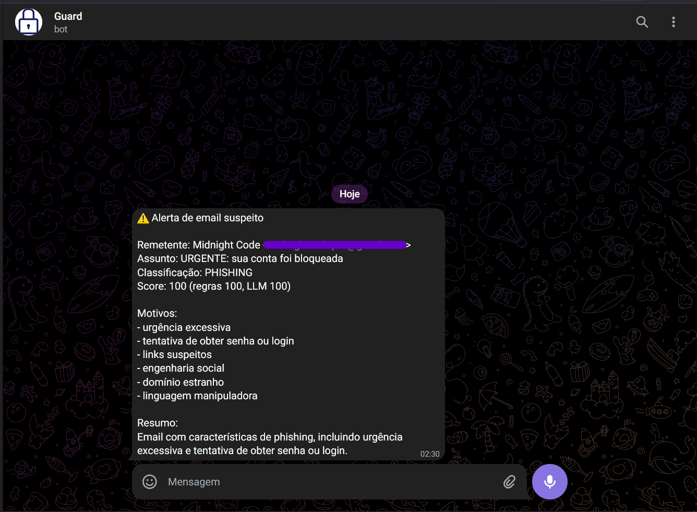

# Email Phishing Monitor (Gmail + Ollama + Telegram)

Projeto simples em Python para monitorar emails do Gmail e detectar possíveis mensagens de phishing usando regras básicas e um modelo local do Ollama.
Quando um email suspeito é detectado, um alerta é enviado para o Telegram.

## Exemplo de alerta no Telegram

Quando um email suspeito é detectado, o bot envia um alerta como este:



---

# 1. Pré-requisitos

Antes de rodar o projeto, você precisa instalar:

* Python
* Ollama
* Conta no Google Cloud
* Bot do Telegram

---

# 2. Instalar Python

Primeiro verifique se o Python já está instalado:

```bash
python --version
```

Se aparecer algo como:

```text
Python 3.x.x
```

então já está instalado.

Se não estiver, baixe no site oficial:

https://www.python.org/downloads/

Durante a instalação marque a opção:

```
Add Python to PATH
```

Depois confirme novamente:

```bash
python --version
```

---

# 3. Criar projeto no Google Cloud

1. Acesse:
   https://console.cloud.google.com/

2. Crie um novo projeto.

3. Vá em:

```
APIs & Services → Library
```

4. Procure por:

```
Gmail API
```

5. Clique em **Enable**.

---

# 4. Criar credenciais para a Gmail API

1. Vá em:

```
APIs & Services → Credentials
```

2. Clique em:

```
Create Credentials
```

3. Escolha:

```
OAuth Client ID
```

4. Tipo de aplicação:

```
Desktop App
```

5. Baixe o arquivo **credentials.json**.

6. Coloque o arquivo na pasta do projeto.

---

# 5. Criar Bot no Telegram

Abra o Telegram e procure por:

```
@BotFather
```

Envie o comando:

```
/start
```

Depois:

```
/newbot
```

Escolha:

* Nome do bot
* Username do bot

O BotFather irá retornar um **TOKEN**, algo como:

```
123456789:AAHxxxxx
```

Guarde esse token.

---

# 6. Descobrir o Chat ID do Telegram

1. Abra o bot criado no Telegram.
2. Envie qualquer mensagem para ele.
3. Acesse no navegador:

```
https://api.telegram.org/botSEU_TOKEN/getUpdates
```

Substitua `SEU_TOKEN` pelo token do bot.

Na resposta JSON procure por:

```
chat
id
```

Esse número é o **CHAT_ID**.

---

# 7. Instalar Ollama

Baixe o Ollama no site oficial:

https://ollama.com/

Depois de instalar, abra o terminal e instale um modelo:

```bash
ollama pull llama3.2:3b
```

Verifique se o Ollama está funcionando:

```bash
ollama list
```

---

# 8. Instalar dependências do projeto

Entre na pasta do projeto:

```bash
cd pasta_do_projeto
```

Instale as dependências:

```bash
pip install -r requirements.txt
```

---

# 9. Configurar variáveis de ambiente

Crie um arquivo chamado:

```
.env
```

Exemplo:

```
TELEGRAM_BOT_TOKEN=SEU_TOKEN
TELEGRAM_CHAT_ID=SEU_CHAT_ID
OLLAMA_MODEL=llama3.2:3b
OLLAMA_URL=http://localhost:11434/api/generate
```

---

# 10. Rodar o projeto

Execute:

```bash
python main.py
```

Na primeira execução será aberta uma URL para autorizar o acesso ao Gmail.

Depois disso o sistema começará a monitorar novos emails.

---

# Funcionamento

O sistema:

1. Monitora novos emails da caixa de entrada
2. Aplica regras simples de detecção de phishing
3. Envia o conteúdo para análise do modelo local do Ollama
4. Se o score for alto, envia alerta no Telegram

---

# Parar o monitoramento

No terminal pressione:

```
Ctrl + C
```

---
